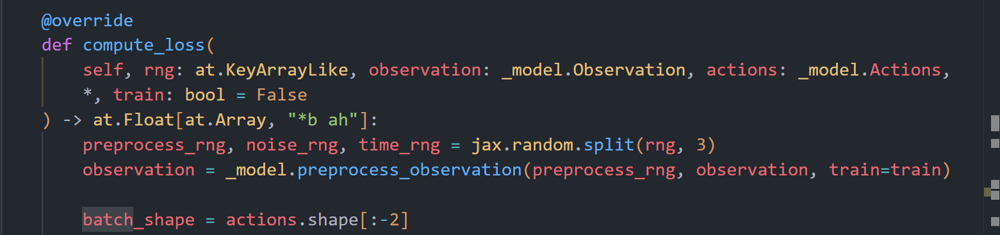
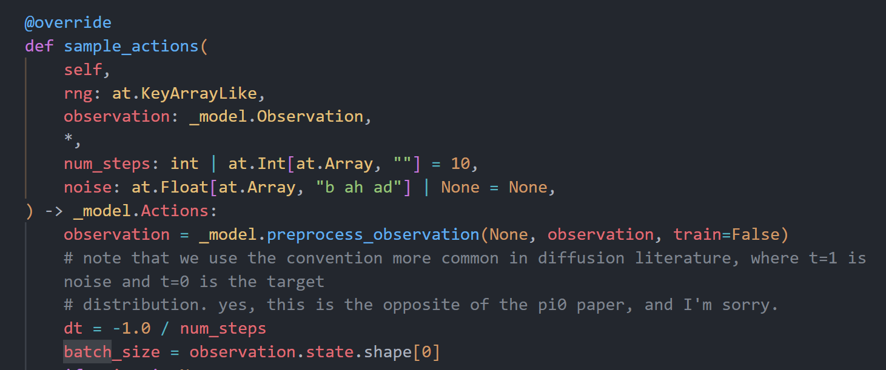

# 1.训练/推理的时候需要输入什么信息
#### 1. 训练过程 (`compute_loss` 函数)


- **`observation` (环境观察)**：这是题干。包含机器人的多视角摄像机画面 (`images`)、文本指令 (`tokenized_prompt`) 以及机器人当前的本体状态 (`state`)。
    
- **`actions` (真实动作)**：这是**标准答案**。模型需要这串真实的动作序列，来生成加了噪点的“考题”，并计算最终的误差。
    
- **`rng` (随机数种子)**：这是“骰子”。用来做图像的随机增强（裁切、变色等）、随机抽取训练进度时间 (`time`)、以及生成高斯噪声底板 (`noise`)。
    

#### 2. 推理过程 (`sample_actions` 函数)


- **`observation` (环境观察)**：和训练时一样，模型必须通过摄像头看到当前画面，通过文本知道你要它干什么。
    
- **`noise` / `rng` (初始纯噪声或种子)**：这是**起点**。因为没有真实动作，模型只能从一块满是雪花点的随机纯噪声开始，一步步去噪。
    
- **`num_steps` (步数)**：告诉模型要分几次走完。比如 `10` 步，就是用欧拉积分每次走十分之一，直到走回真实的动作。
# 2.训练/推理阶段怎么处理信息

## 1. 观察值 (Observation) 处理

### 训练模式

**代码位置**: [`pi0.py:206`](vscode-webview://0jvd0mqagsl2s1ik7vc8vfbet0m7s3710uo1v8o7ljqnpf8qq82v/src/openpi/models/pi0.py#L206) + [`model.py:232-268`](vscode-webview://0jvd0mqagsl2s1ik7vc8vfbet0m7s3710uo1v8o7ljqnpf8qq82v/src/openpi/models/model.py#L232-L268)

**处理内容**:

- **图像 (images)**: 3 个摄像头，每个 [32, 224, 224, 3]
    
    - ✅ **ColorJitter**: 亮度 ±30%, 对比度 ±40%, 饱和度 ±50%
    - ✅ **RandomCrop**: 裁剪 5% (仅 base_0_rgb)
    - ✅ **Rotate**: 旋转 ±5° (仅 base_0_rgb)
    - ✅ **每张图独立随机种子**: `jax.random.split(rng, 32)`
- **状态 (state)**: [32, 14]
    - ❌ 不做增强，直接使用归一化后的值
- **文本提示 (tokenized_prompt)**: [32, 48]
    - ❌ 不做增强，直接使用 tokenized 结果
- **掩码 (masks)**: 自动生成或使用提供的掩码
    

### 推理模式

**代码位置**: [`pi0.py:238`](vscode-webview://0jvd0mqagsl2s1ik7vc8vfbet0m7s3710uo1v8o7ljqnpf8qq82v/src/openpi/models/pi0.py#L238) + [`model.py:222-230`](vscode-webview://0jvd0mqagsl2s1ik7vc8vfbet0m7s3710uo1v8o7ljqnpf8qq82v/src/openpi/models/model.py#L222-L230)

**处理内容**:

- **图像 (images)**: 3 个摄像头，每个 [1, 224, 224, 3]
    
    - ❌ **无增强**
    - ✅ **仅 Resize**: 如果尺寸不是 224×224，保持长宽比缩放
- **状态 (state)**: [1, 14]
    
    - 直接使用归一化后的值
- **文本提示 (tokenized_prompt)**: [1, 48]
    
    - 直接使用 tokenized 结果
- **掩码 (masks)**: 自动生成或使用提供的掩码
    

**关键差异**:

|项目|训练|推理|
|---|---|---|
|Batch Size|32|1|
|图像增强|✅ 启用|❌ 禁用|
|随机性|✅ 每张图独立随机|❌ 确定性|
## 2. 动作 (Actions) 处理

### 训练模式

**代码位置**: [`pi0.py:208-213`](vscode-webview://0jvd0mqagsl2s1ik7vc8vfbet0m7s3710uo1v8o7ljqnpf8qq82v/src/openpi/models/pi0.py#L208-L213)

**输入**: 真实动作 `actions` [32, 50, 14]

**处理流程**:

```python
# 1. 生成随机噪声
noise = jax.random.normal(noise_rng, actions.shape)  # [32, 50, 14]

# 2. 随机采样时间步
time = jax.random.beta(time_rng, 1.5, 1, batch_shape) * 0.999 + 0.001  # [32]

# 3. Flow Matching 插值 🌟🌟这里详细看pi 0 速记
time_expanded = time[..., None, None]  # [32, 1, 1]
x_t = time_expanded * noise + (1 - time_expanded) * actions  # [32, 50, 14]

# 4. 计算目标速度场
u_t = noise - actions  # [32, 50, 14]
```

**数据含义**:

- `actions`: 真实动作（从数据集获取）
- `noise`: 标准正态分布噪声
- `x_t`: 时间 t 的噪声动作（插值结果）
- `u_t`: 目标速度场（从 x_t 到 actions 的方向）

**关键点**:

- ✅ **有真实动作**作为监督信号
- ✅ **单步训练**: 只做一次前向传播
- ✅ **随机时间步**: 每个样本的 t 不同

### 推理模式

**代码位置**: [`pi0.py:243-244`](vscode-webview://0jvd0mqagsl2s1ik7vc8vfbet0m7s3710uo1v8o7ljqnpf8qq82v/src/openpi/models/pi0.py#L243-L244) + [`pi0.py:252-284`](vscode-webview://0jvd0mqagsl2s1ik7vc8vfbet0m7s3710uo1v8o7ljqnpf8qq82v/src/openpi/models/pi0.py#L252-L284)

**输入**: 纯噪声 `noise` [1, 50, 14]

**处理流程**:

```python
# 1. 初始化纯噪声
noise = jax.random.normal(rng, (batch_size, self.action_horizon, self.action_dim))
# noise: [1, 50, 14]

# 2. 迭代去噪（循环 num_steps 次）
dt = -1.0 / num_steps  # 例如 -0.1

def step(carry):
    x_t, time = carry
    
    # 2.1 Embedding Suffix（包含当前噪声动作和时间）
    suffix_tokens, suffix_mask, suffix_ar_mask, adarms_cond = self.embed_suffix(
        observation, x_t, jnp.broadcast_to(time, batch_size)
    )
    
    # 2.2 Transformer 前向传播
    (prefix_out, suffix_out), _ = self.PaliGemma.llm(...)
    
    # 2.3 预测速度场
    v_t = self.action_out_proj(suffix_out[:, -self.action_horizon:])
    
    # 2.4 Euler 积分
    return x_t + dt * v_t, time + dt

# 3. 循环执行
x_0, _ = jax.lax.while_loop(cond, step, (noise, 1.0))
```

**数据含义**:

- `noise`: 起点（纯随机噪声）
- `x_t`: 当前噪声动作（逐步去噪）
- `v_t`: 预测的速度场
- `x_0`: 最终动作（终点）

**关键点**:

- ❌ **无真实动作**
- ✅ **迭代去噪**: 循环 num_steps 次（默认 10 次）
- ✅ **固定时间步序列**: 1.0 → 0.9 → ... → 0.0

**关键差异**:

|项目|训练|推理|
|---|---|---|
|动作来源|真实动作 + 噪声|纯噪声 → 去噪|
|前向次数|1 次|num_steps 次|
|时间步|随机采样|固定序列|
|输出|速度场 v_t|最终动作 x_0|

## 3. Flow Matching 时间步处理

### 训练模式

**代码位置**: [`pi0.py:210`](vscode-webview://0jvd0mqagsl2s1ik7vc8vfbet0m7s3710uo1v8o7ljqnpf8qq82v/src/openpi/models/pi0.py#L210)

**采样方式**:

```python
time = jax.random.beta(time_rng, 1.5, 1, batch_shape) * 0.999 + 0.001
# time: [32]
```

**分布特性**:

- **Beta(1.5, 1) 分布**: 偏向于采样较大的 t 值
- **范围**: (0.001, 1.0)
- **每个样本独立**: 32 个样本有 32 个不同的 t

**为什么用 Beta(1.5, 1)?**

- 偏向于采样 t ≈ 0.7~0.9（更接近噪声）
- 让模型更多地学习"从噪声到动作"的转换
- 避免 t=0 或 t=1 的边界情况

**时间步使用**:

```python
# 插值
x_t = time_expanded * noise + (1 - time_expanded) * actions

# Embedding
suffix_tokens = self.embed_suffix(observation, x_t, time)
```

### 推理模式

**代码位置**: [`pi0.py:241`](vscode-webview://0jvd0mqagsl2s1ik7vc8vfbet0m7s3710uo1v8o7ljqnpf8qq82v/src/openpi/models/pi0.py#L241) + [`pi0.py:252-291`](vscode-webview://0jvd0mqagsl2s1ik7vc8vfbet0m7s3710uo1v8o7ljqnpf8qq82v/src/openpi/models/pi0.py#L252-L291)

**采样方式**:

```python
dt = -1.0 / num_steps  # 例如 -0.1

# 初始时间
time = 1.0

# 每次迭代
time = time + dt  # 1.0 → 0.9 → 0.8 → ... → 0.0
```

**分布特性**:

- **固定序列**: 均匀分布
- **范围**: 1.0 → 0.0
- **步长**: 1 / num_steps

**时间步使用**:

```python
# 每次迭代
def step(carry):
    x_t, time = carry
    
    # Embedding（时间嵌入到 Suffix）
    suffix_tokens = self.embed_suffix(observation, x_t, time)
    
    # 预测速度场
    v_t = self.action_out_proj(suffix_out)
    
    # Euler 积分
    return x_t + dt * v_t, time + dt
```

**关键差异**:

|项目|训练|推理|
|---|---|---|
|采样方式|Beta(1.5, 1) 随机采样|固定均匀序列|
|范围|(0.001, 1.0)|1.0 → 0.0|
|每个样本|独立随机|相同序列|
|使用次数|1 次|num_steps 次|
## 4. Embedding 处理

### 训练模式

**代码位置**: [`pi0.py:216-217`](vscode-webview://0jvd0mqagsl2s1ik7vc8vfbet0m7s3710uo1v8o7ljqnpf8qq82v/src/openpi/models/pi0.py#L216-L217)

**Prefix Embedding** (上下文):

```python
prefix_tokens, prefix_mask, prefix_ar_mask = self.embed_prefix(observation)
```

**内容**:

- **图像 tokens**: 3 摄像头 × 256 = 768 tokens
    - `base_0_rgb`: [32, 256, 2048] (增强后)
    - `left_wrist_0_rgb`: [32, 256, 2048] (增强后)
    - `right_wrist_0_rgb`: [32, 256, 2048] (增强后)
- **语言 tokens**: [32, 48, 2048]
- **状态 token**: [32, 1, 2048] (仅 Pi0)
- **总计**: [32, 817, 2048]

**Suffix Embedding** (动作): 🌟🌟

```python
suffix_tokens, suffix_mask, suffix_ar_mask, adarms_cond = self.embed_suffix(
    observation, x_t, time  # ← 噪声动作 + 时间
)
```
**内容**:

- **动作 tokens**: [32, 50, 2048]
    - 输入: `x_t` (噪声动作)
    - 时间嵌入: 加到每个 token 上
**这里加入time很重要，action和time没有融合，模型根本不知道当前的输入有多“糊”，也就无法预测出正确的去噪力度和方向。这段代码中的 `Concat + MLP` 就是强行把“时间感”注入到模型的每一个动作细胞里去。

### 推理模式

**代码位置**: [`pi0.py:247-250`](vscode-webview://0jvd0mqagsl2s1ik7vc8vfbet0m7s3710uo1v8o7ljqnpf8qq82v/src/openpi/models/pi0.py#L247-L250) + [`pi0.py:254-256`](vscode-webview://0jvd0mqagsl2s1ik7vc8vfbet0m7s3710uo1v8o7ljqnpf8qq82v/src/openpi/models/pi0.py#L254-L256)

**Prefix Embedding** (上下文):

```python
# 只计算一次！
prefix_tokens, prefix_mask, prefix_ar_mask = self.embed_prefix(observation)
_, kv_cache = self.PaliGemma.llm([prefix_tokens, None], ...)
```

**内容**:

- **图像 tokens**: 3 摄像头 × 256 = 768 tokens
    - `base_0_rgb`: [1, 256, 2048] (无增强)
    - `left_wrist_0_rgb`: [1, 256, 2048] (无增强)
    - `right_wrist_0_rgb`: [1, 256, 2048] (无增强)
- **语言 tokens**: [1, 48, 2048]
- **状态 token**: [1, 1, 2048] (仅 Pi0)
- **总计**: [1, 817, 2048]
- **KV Cache**: 缓存 Key 和 Value

**Suffix Embedding** (动作):

```python
# 每次迭代都重新计算！
def step(carry):
    x_t, time = carry
    suffix_tokens, suffix_mask, suffix_ar_mask, adarms_cond = self.embed_suffix(
        observation, x_t, jnp.broadcast_to(time, batch_size)
    )
```

**内容**:

- **动作 tokens**: [1, 50, 2048]
    - 输入: `x_t` (当前噪声动作，每次迭代不同)
    - 时间嵌入: 每次迭代的 time 不同

**关键差异**:

|项目|训练|推理|
|---|---|---|
|Prefix 计算|每个 batch 1 次|整个推理过程 1 次|
|Suffix 计算|1 次|num_steps 次|
|图像内容|增强后|原图|
|KV Cache|❌ 不使用|✅ 使用|
## 5. 注意力掩码 (Attention Mask) 处理

### 训练模式

**代码位置**: [`pi0.py:218-220`](vscode-webview://0jvd0mqagsl2s1ik7vc8vfbet0m7s3710uo1v8o7ljqnpf8qq82v/src/openpi/models/pi0.py#L218-L220)

**掩码生成**:

```python
input_mask = jnp.concatenate([prefix_mask, suffix_mask], axis=1)  # [32, 867]
ar_mask = jnp.concatenate([prefix_ar_mask, suffix_ar_mask], axis=0)  # [867]
attn_mask = make_attn_mask(input_mask, ar_mask)  # [32, 867, 867]
```

**掩码结构**:

```python
def make_attn_mask(input_mask, ar_mask):
    # 因果掩码：只能看到过去
    attn_mask = ar_mask[None, :] <= ar_mask[:, None]  # [867, 867]
    
    # 有效掩码：排除 padding
    valid_mask = input_mask[:, None, :] * input_mask[:, :, None]  # [32, 867, 867]
    
    # 合并
    return jnp.logical_and(attn_mask, valid_mask)
```

**掩码含义**:

```
Prefix (817 tokens):
  - 图像 tokens (768): ar_mask = False (不参与自回归)
  - 语言 tokens (48): ar_mask = False
  - 状态 token (1): ar_mask = True (参与自回归)

Suffix (50 tokens):
  - 动作 tokens (50): ar_mask = True (全部参与自回归)
```

**注意力模式**:

```
         Prefix (817)  Suffix (50)
Prefix   ✅ 可见       ❌ 不可见
Suffix   ✅ 可见       ✅ 因果可见
```

### 推理模式

**代码位置**: [`pi0.py:248-249`](vscode-webview://0jvd0mqagsl2s1ik7vc8vfbet0m7s3710uo1v8o7ljqnpf8qq82v/src/openpi/models/pi0.py#L248-L249) + [`pi0.py:259-265`](vscode-webview://0jvd0mqagsl2s1ik7vc8vfbet0m7s3710uo1v8o7ljqnpf8qq82v/src/openpi/models/pi0.py#L259-L265)

**Prefix 掩码** (只计算一次):

```python
prefix_attn_mask = make_attn_mask(prefix_mask, prefix_ar_mask)  # [1, 817, 817]
```

**Suffix 掩码** (每次迭代):

```python
def step(carry):
    # Suffix 内部注意力
    suffix_attn_mask = make_attn_mask(suffix_mask, suffix_ar_mask)  # [1, 50, 50]
    
    # Suffix 对 Prefix 的注意力
    prefix_attn_mask = einops.repeat(prefix_mask, "b p -> b s p", s=suffix_tokens.shape[1])
    # [1, 50, 817]
    
    # 合并
    full_attn_mask = jnp.concatenate([prefix_attn_mask, suffix_attn_mask], axis=-1)
    # [1, 50, 867]
```

**注意力模式**:

```
Suffix 的 Query 可以 attend 到:
  - 所有 Prefix tokens (817)
  - Suffix 的因果 tokens (≤ 当前位置)
```

**关键差异**:

|项目|训练|推理|
|---|---|---|
|Prefix 掩码|每个 batch 1 次|整个推理过程 1 次|
|Suffix 掩码|1 次|num_steps 次|
|掩码形状|[32, 867, 867]|[1, 50, 867]|
|计算方式|完整掩码|分离 Prefix/Suffix|
## 6. Transformer 前向传播

### 训练模式

**代码位置**: [`pi0.py:222-224`](vscode-webview://0jvd0mqagsl2s1ik7vc8vfbet0m7s3710uo1v8o7ljqnpf8qq82v/src/openpi/models/pi0.py#L222-L224)

**前向传播**:

```python
(prefix_out, suffix_out), _ = self.PaliGemma.llm(
    [prefix_tokens, suffix_tokens],  # ← 同时传入 Prefix + Suffix
    mask=attn_mask,                  # [32, 867, 867]
    positions=positions,             # [32, 867]
    adarms_cond=[None, adarms_cond]  # 仅 Pi0.5 使用
)
```

**输入**:

- `prefix_tokens`: [32, 817, 2048]
- `suffix_tokens`: [32, 50, 2048]
- `attn_mask`: [32, 867, 867]

**输出**:

- `prefix_out`: [32, 817, 2048]
- `suffix_out`: [32, 50, 2048]

**特点**:

- ✅ **一次性前向传播**: Prefix + Suffix 一起处理
- ❌ **不使用 KV Cache**
- ✅ **完整注意力**: 所有 token 之间的注意力

### 推理模式

**代码位置**: [`pi0.py:250`](vscode-webview://0jvd0mqagsl2s1ik7vc8vfbet0m7s3710uo1v8o7ljqnpf8qq82v/src/openpi/models/pi0.py#L250) + [`pi0.py:274-280`](vscode-webview://0jvd0mqagsl2s1ik7vc8vfbet0m7s3710uo1v8o7ljqnpf8qq82v/src/openpi/models/pi0.py#L274-L280)

**第一次前向传播** (Prefix):

```python
_, kv_cache = self.PaliGemma.llm(
    [prefix_tokens, None],  # ← 只传 Prefix
    mask=prefix_attn_mask,
    positions=positions
)
```

**后续前向传播** (Suffix，每次迭代):

```python
def step(carry):
    (prefix_out, suffix_out), _ = self.PaliGemma.llm(
        [None, suffix_tokens],  # ← 只传 Suffix
        mask=full_attn_mask,    # [1, 50, 867]
        positions=positions,    # [1, 50]
        kv_cache=kv_cache,      # ← 使用缓存
        adarms_cond=[None, adarms_cond]
    )
```

**输入**:

- `suffix_tokens`: [1, 50, 2048] (每次迭代不同)
- `kv_cache`: Prefix 的 Key 和 Value (固定)
- `full_attn_mask`: [1, 50, 867]

**输出**:

- `prefix_out`: None (不需要)
- `suffix_out`: [1, 50, 2048]

**特点**:

- ✅ **分离前向传播**: Prefix 1 次，Suffix num_steps 次
- ✅ **使用 KV Cache**: 避免重复计算 Prefix
- ✅ **部分注意力**: 只计算 Suffix 的注意力

**关键差异**:

|项目|训练|推理|
|---|---|---|
|前向次数|1 次|1 + num_steps 次|
|KV Cache|❌ 不使用|✅ 使用|
|输入方式|Prefix + Suffix 一起|Prefix 单独，Suffix 迭代|
|计算量|完整 Transformer|Prefix 1 次 + Suffix 轻量级|
## 7. 输出和损失处理

### 训练模式

**代码位置**: [`pi0.py:225-227`](vscode-webview://0jvd0mqagsl2s1ik7vc8vfbet0m7s3710uo1v8o7ljqnpf8qq82v/src/openpi/models/pi0.py#L225-L227)

**输出处理**:

```python
# 1. 提取 Suffix 输出
suffix_out = suffix_out[:, -self.action_horizon:]  # [32, 50, 2048]

# 2. 预测速度场
v_t = self.action_out_proj(suffix_out)  # [32, 50, 14]

# 3. 计算损失
loss = jnp.mean(jnp.square(v_t - u_t), axis=-1)  # [32, 50]
```

**损失含义**:
- `v_t`: 模型预测的速度场
- `u_t`: 目标速度场 (noise - actions)
- `loss`: MSE 损失 ||v_t - u_t||²

**损失形状**:
- 每个样本每个时间步: [32, 50]
- 平均损失: `jnp.mean(loss)` → scalar

**用途**:
- ✅ **反向传播**: 计算梯度
- ✅ **参数更新**: 优化器更新参数

### 推理模式

**代码位置**: [`pi0.py:282-284`](vscode-webview://0jvd0mqagsl2s1ik7vc8vfbet0m7s3710uo1v8o7ljqnpf8qq82v/src/openpi/models/pi0.py#L282-L284) + [`pi0.py:291-292`](vscode-webview://0jvd0mqagsl2s1ik7vc8vfbet0m7s3710uo1v8o7ljqnpf8qq82v/src/openpi/models/pi0.py#L291-L292)

**输出处理**:

```python
def step(carry):
    x_t, time = carry
    
    # 1. 提取 Suffix 输出
    suffix_out = suffix_out[:, -self.action_horizon:]  # [1, 50, 2048]
    
    # 2. 预测速度场
    v_t = self.action_out_proj(suffix_out)  # [1, 50, 14]
    
    # 3. Euler 积分（无损失计算）
    return x_t + dt * v_t, time + dt

# 4. 返回最终动作
x_0, _ = jax.lax.while_loop(cond, step, (noise, 1.0))
return x_0  # [1, 50, 14]
```

**输出含义**:
- `v_t`: 预测的速度场（每次迭代）
- `x_t`: 当前噪声动作（逐步去噪）
- `x_0`: 最终动作（干净的动作序列）

**用途**:
- ✅ **动作生成**: 输出给机器人执行
- ❌ **无损失计算**
- ❌ **无反向传播**

# 3.训练/推理过程输入的信息类别有没有区别？
## 1️⃣ 观察值
### 训练模式输入

### 推理模式输入

### 有两个点可以分析，
一个是observation的batch_size，训练阶段是明确规定batch_size是32，在config.py文件可以找到；推理阶段batch_size的大小决于你当前传给模型的**机器人状态数据（`observation.state`）的第一个维度的大小**。
原因（为什么batch_size要不同）：

|维度|训练阶段|推理阶段|
|---|---|---|
|**目的**|批量学习，提高效率|实时响应，单个预测|
|**数据来源**|数据集（离线）|机器人传感器（实时）|
|**计算资源**|GPU/TPU 批量并行|单个样本快速推理|
|**时间要求**|可以慢（几小时/几天）|必须快（毫秒级）|
|**Batch Size**|32（或更大）|1（通常）|
另一个是observation的rng，训练阶段的rng会被分裂成三份，preprocess_rng, noise_rng, time_rng；推理阶段rng只用在noise。
## 2️⃣ 动作 (Actions)
### 训练模式输入

**代码位置**: [`pi0.py:202-203`](vscode-webview://0jvd0mqagsl2s1ik7vc8vfbet0m7s3710uo1v8o7ljqnpf8qq82v/src/openpi/models/pi0.py#L202-L203)
```python
def compute_loss(
    self, 
    rng: at.KeyArrayLike, 
    observation: _model.Observation,
    actions: _model.Actions,  # ← 必需！真实动作
    *, 
    train: bool = False
):
```

**动作内容**:
```python
actions = float32[32, 50, 14]  # 真实动作序列
```
**用途**:
- 作为监督信号
- 用于 Flow Matching 插值: `x_t = t·noise + (1-t)·actions`
- 计算目标速度场: `u_t = noise - actions`

### 推理模式输入

**代码位置**: [`pi0.py:230-237`](vscode-webview://0jvd0mqagsl2s1ik7vc8vfbet0m7s3710uo1v8o7ljqnpf8qq82v/src/openpi/models/pi0.py#L230-L237)
```python
def sample_actions(
    self,
    rng: at.KeyArrayLike,
    observation: _model.Observation,
    *,
    num_steps: int = 10,
    noise: at.Float[at.Array, "b ah ad"] | None = None  # ← 可选噪声
):
    # 没有 actions 参数！
```

**动作内容**:
```python
# 推理模式不需要真实动作！
# 只需要初始噪声（可选）
noise = float32[1, 50, 14]  # 如果不提供，会随机生成
```
**用途**:
- 从纯噪声开始
- 通过迭代去噪生成动作
## 3️⃣ 随机种子 (RNG)
### 训练模式输入

**代码位置**: [`pi0.py:202`](vscode-webview://0jvd0mqagsl2s1ik7vc8vfbet0m7s3710uo1v8o7ljqnpf8qq82v/src/openpi/models/pi0.py#L202)
```python
def compute_loss(
    self, 
    rng: at.KeyArrayLike,  # ← 随机种子
    observation: _model.Observation,
    actions: _model.Actions,
    *, 
    train: bool = False
):
```

**用途**:
```python
preprocess_rng, noise_rng, time_rng = jax.random.split(rng, 3)

# 1. 图像增强
observation = _model.preprocess_observation(preprocess_rng, observation, train=True)

# 2. 噪声生成
noise = jax.random.normal(noise_rng, actions.shape)

# 3. 时间步采样
time = jax.random.beta(time_rng, 1.5, 1, batch_shape)
```

### 推理模式输入

**代码位置**: [`pi0.py:230-232`](vscode-webview://0jvd0mqagsl2s1ik7vc8vfbet0m7s3710uo1v8o7ljqnpf8qq82v/src/openpi/models/pi0.py#L230-L232)
```python
def sample_actions(
    self,
    rng: at.KeyArrayLike,  # ← 随机种子
    observation: _model.Observation,
    *,
    num_steps: int = 10,
    noise: at.Float[at.Array, "b ah ad"] | None = None
):
```

**用途**:
```python
# 1. 图像预处理（不使用随机种子）
observation = _model.preprocess_observation(None, observation, train=False)

# 2. 噪声生成（如果没有提供噪声）
if noise is None:
noise = jax.random.normal(rng, (batch_size, self.action_horizon, self.action_dim))
```
## **误区🌟🌟🌟**
从代码上看很容易觉得noise在训练和推理阶段用的是同一个rng，**实际上不是。**
### 训练阶段的 noise 生成
**代码位置**: [`train.py:153`](vscode-webview://0jvd0mqagsl2s1ik7vc8vfbet0m7s3710uo1v8o7ljqnpf8qq82v/scripts/train.py#L153) → [`pi0.py:205, 209`](vscode-webview://0jvd0mqagsl2s1ik7vc8vfbet0m7s3710uo1v8o7ljqnpf8qq82v/src/openpi/models/pi0.py#L205)
```python
# train.py:153
train_rng = jax.random.fold_in(rng, state.step)  # ← 每步不同

# pi0.py:205
preprocess_rng, noise_rng, time_rng = jax.random.split(train_rng, 3)

# pi0.py:209
noise = jax.random.normal(noise_rng, actions.shape)  # ← 使用 noise_rng
# noise: float32[32, 50, 14]
```
**特点**:
- 使用 `noise_rng`（从 `train_rng` 分裂出来的子种子）
- 每个训练步的 `train_rng` 都不同
- 因此每个训练步的 `noise_rng` 也不同
- 生成的 `noise` 每次都不同
---
### 推理阶段的 noise 生成
**代码位置**: [`pi0.py:244`](vscode-webview://0jvd0mqagsl2s1ik7vc8vfbet0m7s3710uo1v8o7ljqnpf8qq82v/src/openpi/models/pi0.py#L244)
```python
# pi0.py:244
if noise is None:
    noise = jax.random.normal(rng, (batch_size, self.action_horizon, self.action_dim))
    # ← 直接使用传入的 rng
# noise: float32[1, 50, 14]
```
**特点**:
- 直接使用外部传入的 `rng`
- 不经过 `fold_in` 或 `split`
- 每次推理的 `rng` 可以相同或不同（取决于外部如何传入）
- 如果 `rng` 相同，生成的 `noise` 就相同
### 🔬 实际例子
#### 例子 1: 训练阶段

```python
# 初始种子
rng = jax.random.PRNGKey(42)

# 第 1 个训练步 (step=0)
train_rng_0 = jax.random.fold_in(rng, 0)
preprocess_rng_0, noise_rng_0, time_rng_0 = jax.random.split(train_rng_0, 3)
noise_0 = jax.random.normal(noise_rng_0, (32, 50, 14))
# noise_0: 例如 [[0.123, -0.456, ...], ...]

# 第 2 个训练步 (step=1)
train_rng_1 = jax.random.fold_in(rng, 1)  # ← 不同于 train_rng_0
preprocess_rng_1, noise_rng_1, time_rng_1 = jax.random.split(train_rng_1, 3)
noise_1 = jax.random.normal(noise_rng_1, (32, 50, 14))  # ← 不同于 noise_0
# noise_1: 例如 [[-0.789, 0.234, ...], ...]
结论: noise_0 ≠ noise_1
```
 结论: 每一步的noise不可能相同，因为每次从外部rng分裂后的内容不可能是相同的。
 
#### 例子 2: 推理阶段

```python
# 第 1 次推理
rng_1 = jax.random.PRNGKey(123)
noise_1 = jax.random.normal(rng_1, (1, 50, 14))
# noise_1: 例如 [[0.567, -0.890, ...], ...]

# 第 2 次推理（使用相同的 rng）
rng_2 = jax.random.PRNGKey(123)  # ← 相同的种子
noise_2 = jax.random.normal(rng_2, (1, 50, 14))
# noise_2: 例如 [[0.567, -0.890, ...], ...]

# 结论: noise_1 == noise_2 (因为 rng 相同)

# 第 3 次推理（使用不同的 rng）
rng_3 = jax.random.PRNGKey(456)  # ← 不同的种子
noise_3 = jax.random.normal(rng_3, (1, 50, 14))
# noise_3: 例如 [[-0.123, 0.456, ...], ...]
结论: noise_1 ≠ noise_3 (因为 rng 不同)
```
 结论: noise_1和noise_2可以相同也可以不同，取决于rng是不是一样的
 
 ### **为什么要这样设计？**

**训练阶段**:
- 需要每个训练步都有不同的随机性
- 避免模型记住特定的噪声模式
- 提高泛化能力

**推理阶段**:
- 需要可控的随机性
- 可以固定 rng 来复现结果
- 也可以改变 rng 来生成不同的动作

# 4.去噪过程和大语言模型的过程在训练和推理阶段，谁先做还是一起做？
这两个过程在不同阶段的执行关系是不同的。

- **训练过程：先跑大语言模型，再计算流匹配（去噪）损失。**
    
    - 具体而言，模型会先将观察到的图像、文本（Prefix）以及加了噪声的动作和当前时间步（Suffix）全部转换成 Token。
        
    - 然后，将这些 Token 送入大语言模型（PaliGemma / Action Expert）进行前向传播，输出预测的去噪流场向量 ($v_t$)。
        
    - 最后，将大模型预测出的向量 ($v_t$) 与真实的去噪流向 ($u_t$) 进行对比，算出均方误差损失 (Loss)。
        
    - **特别纠正：** 这个损失值随后会通过**反向传播**（而不是前向传播）计算出梯度，最终交给优化器去修改模型的参数，以此增强模型能力。
        
- **推理过程：这是一个嵌套循环的过程，大语言模型被包裹在去噪循环的内部。**
    
    - **循环外（先做）**：在真正开始去噪前，模型会**先**处理静态的图像和文本信息，通过一次大语言模型的前向传播计算出 Prefix 的特征，并存入 KV Cache 以节省算力。
        
    - **循环内（交替做）**：随后进入去噪循环（例如 10 步）。在**每一次迭代中**，模型都需要**先**把当前的噪声状态转化成 Suffix Token，送入大语言模型预测出当前的去噪速度 ($v_t$)。**然后**利用这个速度，通过积分公式（$x_t + dt \cdot v_t$）走一小步，完成当前这一步的去噪。
# 5.noise action 这个输入是从哪里获取的，以及它为什么要这样获取，这样获取是最好的方法吗？
无论是在训练还是推理阶段，代表满屏雪花的 `noise` 都是通过 JAX 框架自带的随机数生成器（`jax.random.normal`）动态生成的高斯噪声。

- **训练时如何获取：严格分裂。**
    
    - 训练过程的输入来自于 `rng` 分裂出的专用子钥匙 `noise_rng`。
        
    - **为什么这么做？** 为了**保证数学上的完全独立性**。JAX 要求无状态的随机生成，通过强制 `split` 分裂钥匙，可以保证“生成噪声”、“数据增强”和“采样时间步”这三件事互不干扰，防止产生错误的强相关性。
        
- **推理时如何获取：外部控制。**
    
    - 推理过程直接使用由外部传入的 `rng` 钥匙来生成初始噪声（代码也支持完全跳过生成，直接由人类在外部强行传入一个预设的 `noise` 矩阵）。
        
    - **为什么这么做？** 为了**极强的可复现性**。JAX 的随机机制依赖显式传入的 `rng: at.KeyArrayLike`。在测试时，工程师只要在外部配置文件中设定一个固定的随机种子（例如 `seed: int = 42`），无论跑多少次，模型第一步生成的初始噪声都完全一模一样，这对于 Debug 调试和科学实验对比是至关重要的。

**这样获取是最好的吗**
代码里使用 `jax.random.normal` 生成标准的高斯噪声（通常被称为“白噪声”），是目前流匹配和扩散模型里的“行业标配”。之所以被广泛使用，是因为它在数学上极其优雅，计算起来最简单。但这**绝对不是唯一的方法，甚至在某些特定场景下，它并不一定是“最好”的方法**。
### 1. 时间相关噪声 (Temporally Correlated Noise / Colored Noise)
- **痛点**：标准的高斯“白噪声”在每一个时间步长（比如机器人的 50 步动作里）都是完全独立、毫无关联的。但物理世界中，机械臂的运动是**极其平滑连续**的。
    
- **优化思路**：把白噪声换成**“粉红噪声 (Pink Noise)”**或者具有时间相关性的平滑噪声。
    
- **效果**：这样模型在去噪时，起点就不再是极其杂乱的跳跃点，而是带有一定平滑趋势的波浪。这能极大地减轻模型学习“动作连续性”的负担，通常能让机器人生成的轨迹更丝滑，减少物理关节的抖动。
    
### 2. 冷扩散 (Cold Diffusion / Deterministic Degradation)
- **痛点**：谁规定起点一定要是“随机雪花点”呢？
    
- **优化思路**：不使用随机数生成器，而是使用某种**确定的物理退化方式**。比如，把真实的清晰动作轨迹，通过数学方法进行极度平滑（Smoothing）、下采样、或者直接把一部分动作遮掩掉（Masking）。
    
- **效果**：模型学习的任务就从“从纯随机里猜动作”，变成了“把模糊/残缺的动作补充完整”。这在某些对安全性要求极高的机械臂任务里，收敛速度会快得多。